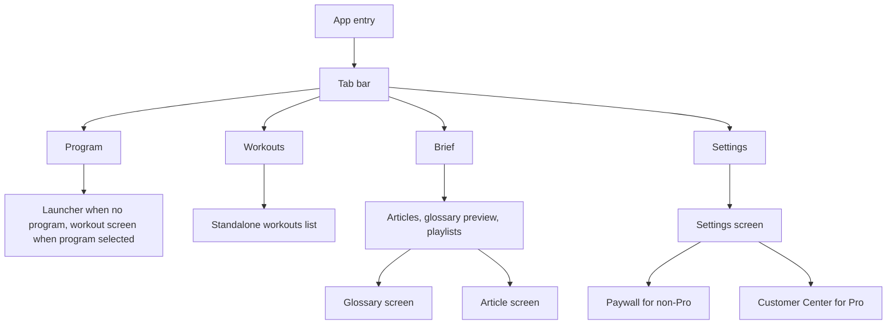

# Tempered Strength

A React Native (Expo) strength training app with structured programs, standalone workouts, and a Brief (articles, glossary, playlists). For anyone following in-gym programs or one-off workouts and wanting a single place to run sessions and read training intel.

## Tech stack

- **Runtime**: Node (see [package.json](package.json) `engines` and [.nvmrc](.nvmrc); e.g. Node >= 20.19.4).
- **App**: Expo SDK 54, React Native, React 19, TypeScript.
- **Routing**: [expo-router](https://docs.expo.dev/router/introduction/) (file-based), with tabs and stack.
- **Key libraries**: React Navigation (tabs, stack), AsyncStorage, RevenueCat (`react-native-purchases`, `react-native-purchases-ui`), Reanimated, Gesture Handler, Safe Area Context, Screens.
- **Tooling**: ESLint (expo config), Prettier, Jest (jest-expo, React Native Testing Library).

## Features

- **Programs**: User selects one built-in program (e.g. PPL, Strength 5-day, Full Body 2-day, Powerlifting 3-day, Olympic Foundations, Olympic Advanced 8-week). Programs live in [src/data/programs/](src/data/programs/); active program and related state are stored in AsyncStorage.
- **Program workflow**: Program launcher → choose day → workout screen with exercise list, rest timer, exercise swaps (alternatives by movement pattern via [src/utils/pivotEngine.ts](src/utils/pivotEngine.ts)), set logging, and notes. Reset or change program from Settings.
- **Standalone workouts**: Separate workout list ([src/data/workouts.ts](src/data/workouts.ts)) with filters (duration, category: Strength, WOD, Hyrox, Conditioning, Mobility), favorites, and Pro-gated access.
- **Brief**: “Daily intel” tab — featured article, other articles, glossary preview, playlists; full glossary ([app/glossary.tsx](app/glossary.tsx)) and article detail ([app/article/[id].tsx](app/article/[id].tsx)); content in [src/data/brief/](src/data/brief/).
- **Subscription**: RevenueCat “Pro” entitlement; paywall for non-Pro users, Customer Center for Pro users; see [src/services/revenueCatService.ts](src/services/revenueCatService.ts) and [src/hooks/subscription-context.tsx](src/hooks/subscription-context.tsx).

## Project structure

- **`app/`**: Expo Router routes — `(tabs)/` (index, workouts, brief, settings), `paywall`, `customer-center`, `glossary`, `article/[id]`.
- **`src/`**: Types (`types/`), data (`data/`, `data/programs/`, `data/brief/`), screens (`screens/`), components (`components/`, `components/brief/`, `components/ui/`), hooks (`hooks/`), services (`services/`), utils (`utils/`), tests (`__tests__/`).



Coding standards and AI/contributor rules: [AGENTS.md](AGENTS.md) and `.cursor/rules/`.

## Prerequisites and getting started

**Prerequisites**: Node (version from [.nvmrc](.nvmrc) / [package.json](package.json) `engines`), npm, iOS Simulator and/or Android emulator (or Expo Go). Optional: [EAS CLI](https://docs.expo.dev/build/setup/) for builds.

1. Install dependencies:

   ```bash
   npm install
   ```

2. Start the app:

   ```bash
   npx expo start
   ```

   Use `npm run start-clean` to start with a cleared cache.

3. Run on a device/simulator: From the Expo dev tools you can open a [development build](https://docs.expo.dev/develop/development-builds/introduction/), [Android emulator](https://docs.expo.dev/workflow/android-studio-emulator/), [iOS simulator](https://docs.expo.dev/workflow/ios-simulator/), or [Expo Go](https://expo.dev/go).

## Environment and configuration

The app uses [RevenueCat](https://www.revenuecat.com/) for subscriptions. API keys are read from environment variables:

- `EXPO_PUBLIC_REVENUECAT_API_KEY_IOS`
- `EXPO_PUBLIC_REVENUECAT_API_KEY_ANDROID`

See [eas.json](eas.json) and [src/services/revenueCatService.ts](src/services/revenueCatService.ts): development builds use test keys (or fallbacks in code); production and TestFlight builds must use EAS secrets and production keys. Do not commit production keys. For local development, test keys are sufficient; you can set env in a `.env` file or via EAS build environment.

## Testing

- **Run tests**: `npm test`
- **Watch mode**: `npm run test:watch`
- **Coverage**: `npm run test:coverage`

Tests use Jest, jest-expo, and React Native Testing Library and live under `src/__tests__/` (e.g. storage, rest timer, program, pivotEngine). CI runs Jest on pull requests ([.github/workflows/jest.yml](.github/workflows/jest.yml)).

## Scripts

| Script                  | Description              |
| ----------------------- | ------------------------ |
| `npm start`             | Start Expo dev server    |
| `npm run start-clean`   | Start with cache cleared |
| `npm run android`       | Start and open Android   |
| `npm run ios`           | Start and open iOS       |
| `npm run web`           | Start and open web       |
| `npm run format`        | Format with Prettier     |
| `npm run format:check`  | Check formatting         |
| `npm run lint`          | Run ESLint               |
| `npm test`              | Run Jest                 |
| `npm run test:watch`    | Jest watch mode          |
| `npm run test:coverage` | Jest with coverage       |

## Code quality and conventions

- **Linting**: `npm run lint` (ESLint). **Formatting**: `npm run format`, `npm run format:check` (Prettier). Use the existing config; do not disable rules or reformat unrelated code (see [.cursor/rules/linting-formatting.mdc](.cursor/rules/linting-formatting.mdc)).
- **Commits**: [Conventional Commits](https://www.conventionalcommits.org/) (e.g. `feat`, `fix`, `refactor`, `chore`, `docs`); small, focused commits (see [.cursor/rules/commits.mdc](.cursor/rules/commits.mdc)).
- **Contributing**: Follow [AGENTS.md](AGENTS.md) and `.cursor/rules/` for patterns and standards.

## Build and distribution

Production and TestFlight builds use [EAS Build](https://docs.expo.dev/build/introduction/). Configure RevenueCat production API keys as EAS secrets; see [eas.json](eas.json) for build profiles.

## Learn more

- [Expo documentation](https://docs.expo.dev/)
- [expo-router](https://docs.expo.dev/router/introduction/)
- [RevenueCat](https://www.revenuecat.com/docs)
- [React Native](https://reactnative.dev/)
- [TypeScript](https://www.typescriptlang.org/)
