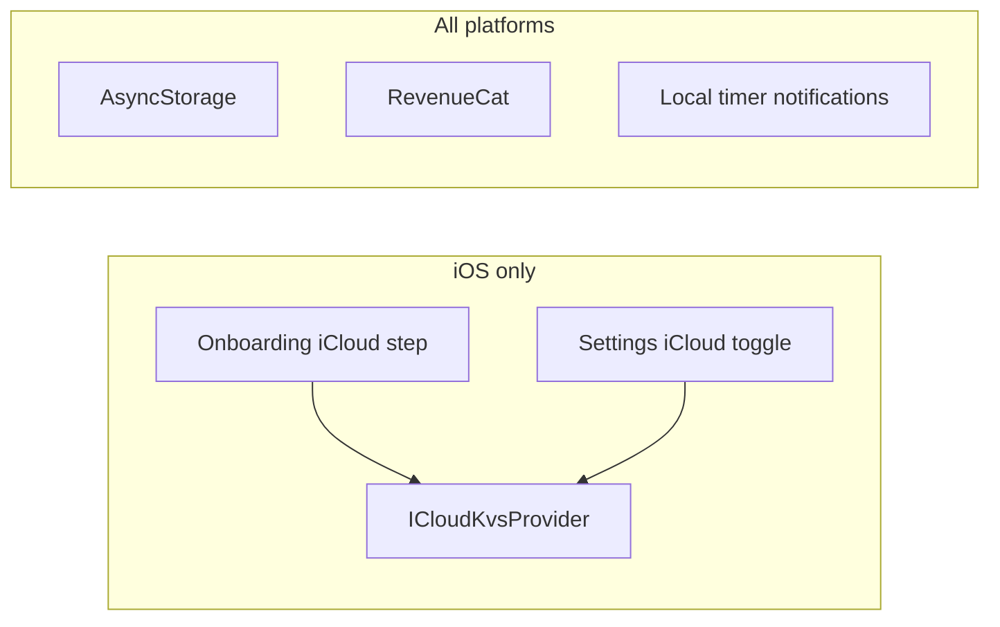

# Android migration and Play Store launch

Guide for adding Android support to Tempered Strength (Expo SDK 54) and shipping an initial Google Play release.

## Implementation status

| Item | Status |
|------|--------|
| This document | Done |
| Code / config (appendix below) | Done |
| Play Console + RevenueCat dashboard | Manual — see checklists in this doc |
| First `eas build --platform android` | Manual — run when ready |

## Current state

The app is **iOS-first** today:

- `app.json` has `ios` (iCloud) and `android` (package, adaptive icon, notification permission).
- `eas.json` injects RevenueCat keys for both platforms.
- Native `/android` and `/ios` folders are gitignored; EAS prebuild generates them on build.

Cross-platform pieces already in place: tab icons (`icon-symbol.tsx` / `icon-symbol.ios.tsx`), haptics gated on iOS in `haptic-tab.tsx`.

## Architecture (sync and stores)



On Android, sync uses `NoopSyncProvider`; data stays local in AsyncStorage.

---

## Code changes (implemented in repo)

| Area | Behavior on Android |
|------|-------------------|
| Onboarding | Skips iCloud step (index 6); jumps from weight units → welcome |
| Account → General | iCloud Sync row hidden |
| Settings hub copy | No iCloud mention in General settings description |
| Sync manager | Never uses `ICloudKvsProvider`; clears stale `icloud_sync_enabled` |
| Records tab icon | `trophy.fill` mapped in `icon-symbol.tsx` |
| Onboarding keyboard | `KeyboardAvoidingView` only on iOS; `softwareKeyboardLayoutMode: resize` on Android |
| Timer notifications | `localNotifications.ts` lazy-loads module; skipped in Expo Go on Android |
| RevenueCat | Platform-specific API key via `EXPO_PUBLIC_REVENUECAT_API_KEY_ANDROID` |

Shared helper: `src/utils/platform.ts` (`isIos`).

---

## Expo Go limitations (Android)

### expo-notifications

Expo Go on Android (SDK 53+) logs that **remote push** was removed from Expo Go. This app only uses **local scheduled notifications** (rest timer), but the module still initializes at startup.

- **Expo Go:** Warning is expected; timer notifications do not work reliably.
- **Testing notifications:** Use `eas build --profile development --platform android`, not Expo Go.
- **Production:** Works in your own AAB once `POST_NOTIFICATIONS` is granted (Android 13+). No FCM required for local timers.

See: [Development builds](https://docs.expo.dev/develop/development-builds/introduction/).

### Subscriptions

Treat **development build on a physical device** with a Play **license tester** account as the source of truth for Android IAP—not Expo Go.

---

## RevenueCat checklist (manual — dashboard + Play Console)

RevenueCat is integrated in code (`revenueCatService.ts`, `subscription-context.tsx`, `paywall.tsx`). Android needs dashboard + Play products + EAS secrets.

### A. RevenueCat dashboard

1. Project → **Apps** → **Add app** → Google Play Store.
2. Package name: `com.kieranvenison.temperedstrengthapp`.
3. **Credentials:** Play Console → Setup → API access → service account JSON → upload in RevenueCat.
4. Entitlement ID: **`Tempered Strength Pro`** (must match iOS).
5. Attach Play product IDs to that entitlement.
6. Ensure **Offerings** / paywall include Android packages.
7. Copy Android SDK key (`goog_…` production or `test_…` sandbox).

### B. Google Play Console

1. Create app (draft OK for testing).
2. **Monetize → Products:** subscriptions `monthly`, `yearly`; one-time `lifetime` (IDs must match RevenueCat).
3. Activate base plans and pricing.
4. **License testing:** add tester Gmail accounts.
5. Upload an **internal testing** AAB with the same `applicationId`.

### C. Repo / EAS

1. Set `EXPO_PUBLIC_REVENUECAT_API_KEY_ANDROID` in Expo project env (production/preview).
2. `eas.json` references `${EXPO_PUBLIC_REVENUECAT_API_KEY_ANDROID}` for builds.
3. Optional local `.env` with test key for dev builds.

### D. Verification

| Step | Check |
|------|--------|
| Build | `npm run build:android:production` or development profile |
| Install | Physical device, license tester account |
| Paywall | Offerings load (no empty offerings alert) |
| Purchase | RC dashboard shows transaction; Pro unlocks |
| Restore | Works after reinstall |

### Common mistakes

- iOS `appl_` key on Android.
- Play products not linked in RevenueCat.
- Product ID mismatch between Play and RC.
- Testing without license tester on draft app.

---

## Build and release

### Local / dev

```bash
npm run android          # Expo dev server → Android emulator/device
npm run build:android:production   # EAS production AAB
```

### First Android EAS build

```bash
eas build --platform android --profile development
```

Confirm prebuild succeeds (`expo-icloud-storage` must not break Android native build). Fix autolinking only if the build fails.

### Play Store checklist (manual)

**Accounts & legal**

- [ ] Google Play Developer account
- [ ] Privacy policy URL (HTTPS)
- [ ] App is **free** with in-app subscriptions
- [ ] Data safety form (AsyncStorage, PostHog, Sanity, RevenueCat)
- [ ] Content rating (IARC)

**Store listing**

- [ ] Title, descriptions, category (Health & Fitness)
- [ ] Screenshots, feature graphic (1024×500), icon
- [ ] Support email

**Release**

- [ ] Internal testing track first
- [ ] `eas submit --platform android --profile production` (configure service account in `eas.json` when ready)
- [ ] Staged rollout to production
- [ ] OTA (`eas update`) only after production binary with matching `runtimeVersion`

**Target API:** New apps must target API 35+ (Android 15) as of Aug 2025. Confirm in EAS build logs / Play pre-launch report.

### Submit config (when ready)

Add to `eas.json` `submit.production.android` (do not commit service account JSON):

```json
"android": {
  "serviceAccountKeyPath": "./google-play-service-account.json",
  "track": "internal"
}
```

---

## Implementation order (reference)

1. UX fixes: Records icon, onboarding keyboard.
2. iCloud gating (sync, onboarding, settings).
3. `app.json` / `eas.json` / RevenueCat keys / npm scripts.
4. First EAS Android build + device QA.
5. **Release assets** (native build only, not OTA): `assets/onboarding.mp4` must be **H.264** (not HEVC/4K); Android launcher uses `assets/images/android_icon.png`; splash plugin uses `splash-icon.png` (light) and `dark-splash-icon.png` (dark).
6. Play Console + RevenueCat linkage.
7. Internal testing → production rollout.

---

## Files to touch

- `src/utils/platform.ts` (new)
- `src/screens/OnboardingFlow.tsx`
- `src/hooks/sync-manager-context.tsx`
- `app/account/general.tsx`
- `app/(tabs)/settings.tsx`
- `src/components/ui/icon-symbol.tsx`
- `src/services/revenueCatService.ts`
- `src/hooks/useTimerNotification.ts`
- `app.json`
- `eas.json`
- `package.json`
- `README.md` (link to this doc)

---

## Appendix — code changes to apply

### 1. `src/utils/platform.ts` (new file)

```ts
import { Platform } from 'react-native';

export const isIos = Platform.OS === 'ios';
```

### 2. `src/components/ui/icon-symbol.tsx`

Add to `MAPPING`:

```ts
'trophy.fill': 'emoji-events',
```

### 3. `src/hooks/sync-manager-context.tsx`

- Import `Platform` and `isIos` from `@/src/utils/platform`.
- In `buildManager`: if `!isIos`, always use `NoopSyncProvider` (even when `nextEnabled` is true).
- In init `useEffect`: if `!isIos` and `raw === 'true'`, set `SYNC_ENABLED_KEY` to `'false'` before `buildManager(false)`.

### 4. `src/screens/OnboardingFlow.tsx`

- Import `isIos` from `@/src/utils/platform`, `Platform` if needed.
- Constants: `ICLOUD_STEP = 6`, `WELCOME_STEP = 7`.
- Helpers: `nextStepIndex(i)` — from 5 jump to 7 when `!isIos`; `prevStepIndex(i)` — from 7 go to 5 when `!isIos`.
- Use helpers in `advanceOrFinish`, `handleSkipStep`, `handleBackStep`.
- `totalProgressSteps = isIos ? 7 : 6`; map `progressCurrent` skipping step 6 on Android.
- Skip iCloud preload in mount `useEffect` when `!isIos`.
- Keyboard: `const KeyboardWrapper = isIos ? KeyboardAvoidingView : View`; `behavior={isIos ? 'padding' : undefined}`.

### 5. `app/account/general.tsx`

Wrap iCloud `settingItem` in `{isIos ? ( ... ) : null}`.

### 6. `app/(tabs)/settings.tsx`

General settings description: iOS keeps “Weight units, iCloud sync, onboarding preferences.”; Android: “Weight units and onboarding preferences.”

### 7. `src/services/revenueCatService.ts`

Platform-select key; `__DEV__` validation accepts `goog_` on Android and `appl_` on iOS.

### 8. `src/services/localNotifications.ts`

Central gate using `isRunningInExpoGo()` from `expo` + `Platform.OS === 'android'`. Uses `require('expo-notifications')` only when allowed. `useTimerNotification`, `WorkoutScreen`, and `app/account/program.tsx` must not import `expo-notifications` directly.

### 9. `app.json` — add inside `"expo"`:

```json
"android": {
  "package": "com.kieranvenison.temperedstrengthapp",
  "softwareKeyboardLayoutMode": "resize",
  "adaptiveIcon": {
    "foregroundImage": "./assets/images/android_icon.png",
    "backgroundColor": "#121212"
  },
  "permissions": ["android.permission.POST_NOTIFICATIONS"]
}
```

### 10. `eas.json` — add to each build profile `env`:

```json
"EXPO_PUBLIC_REVENUECAT_API_KEY_ANDROID": "test_SnvzLVCMTIHpdvZxNJETTYDrEhL"
```

(preview/production: `"${EXPO_PUBLIC_REVENUECAT_API_KEY_ANDROID}"`)

### 11. `package.json` scripts

```json
"build:android:production": "eas build --platform android --profile production"
```

### 12. `README.md`

Under Build and distribution, link to `docs/ANDROID_MIGRATION.md` and note Android notification/IAP testing requires a development build, not Expo Go.
