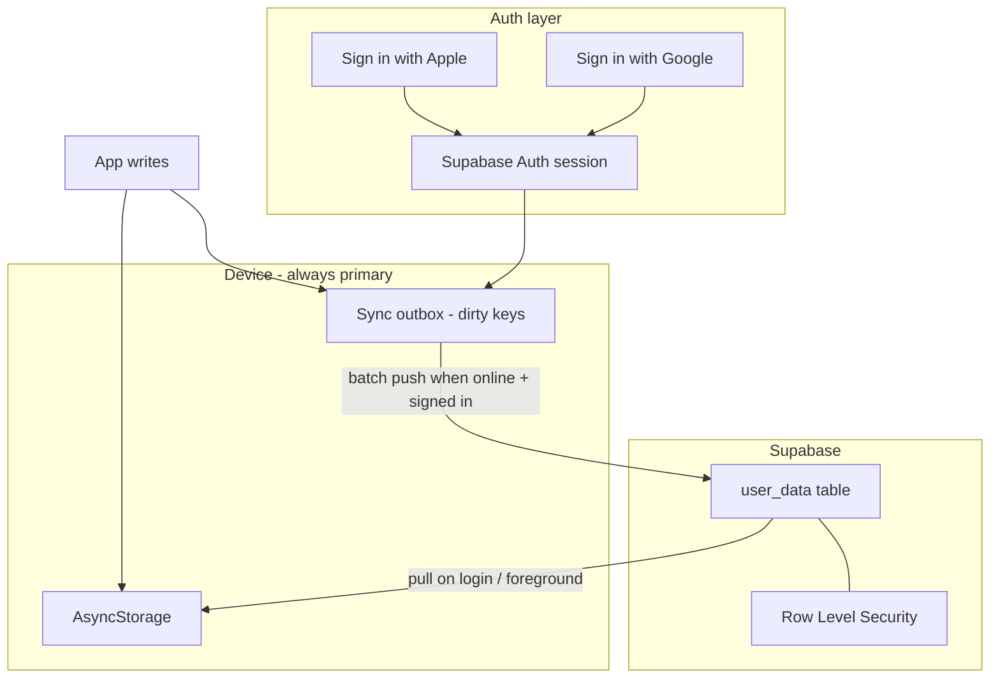

# Supabase Sync Migration Plan

## Assessment: your approach is sound

The direction matches how the app is already built:

- **AsyncStorage stays primary** — the app already works fully offline; cloud is a mirror ([`src/sync/syncStorage.ts`](../src/sync/syncStorage.ts), [`src/utils/storage/internal.ts`](../src/utils/storage/internal.ts)).
- **Existing `SyncProvider` abstraction** — swap [`ICloudKvsProvider`](../src/sync/providers/ICloudKvsProvider.ts) for a `SupabaseSyncProvider` without rewriting storage modules.
- **Program vs records split** — [`clearProgramData()`](../src/utils/storage/programState.ts) already deletes program-scoped keys locally while **keeping** `personal_bests`, `standalone_workout_logs`, favorites, settings, streaks, etc. The same key split maps cleanly to Supabase lifecycle rules.
- **Clean iCloud cutover** — no iCloud migration; existing iCloud data is abandoned.

You do **not** need magic links. Apple/Google OAuth uses a browser redirect back to your existing scheme (`temperedstrengthapp://`).

---

## iCloud removal: same release, no coexistence

**Yes — iCloud is removed entirely as part of this work.** There is no interim state where both iCloud and Supabase exist. When Supabase sync ships, iCloud is gone.

The swap happens in **Phase 2** (sync provider), not as a later cleanup:

1. Delete `ICloudKvsProvider` and `expo-icloud-storage`.
2. Remove iCloud entitlements from [`app.json`](../app.json).
3. Remove iCloud onboarding step and settings toggle.
4. Wire `SupabaseSyncProvider` into the existing `SyncManager` in the same PR.

Storage modules keep calling `syncSetItem` / `syncRemoveItem` — only the provider behind the mirror changes.

### Files to delete

| File | Reason |
|------|--------|
| [`src/sync/providers/ICloudKvsProvider.ts`](../src/sync/providers/ICloudKvsProvider.ts) | Replaced by SupabaseSyncProvider |
| [`src/components/sync/ICloudSyncConflictModal.tsx`](../src/components/sync/ICloudSyncConflictModal.tsx) | Replaced by generic `SyncConflictModal` |
| [`src/components/sync/iCloudSyncConflictModalStyles.ts`](../src/components/sync/iCloudSyncConflictModalStyles.ts) | iCloud-specific styling |

### Files to modify (iCloud references removed)

| File | Change |
|------|--------|
| [`app.json`](../app.json) | Remove `usesIcloudStorage`, `com.apple.developer.ubiquity-kvstore-identifier` entitlement |
| [`package.json`](../package.json) | Remove `expo-icloud-storage`; add Supabase/auth deps |
| [`src/hooks/sync-manager-context.tsx`](../src/hooks/sync-manager-context.tsx) | Drop `ICloudKvsProvider`, iOS-only gate, `icloud_sync_enabled` toggle; use auth-gated Supabase provider |
| [`src/screens/OnboardingFlow.tsx`](../src/screens/OnboardingFlow.tsx) | Remove step 6 (iCloud backup); replace with account sign-in step |
| [`app/account/general.tsx`](../app/account/general.tsx) | Remove iCloud Sync toggle |
| [`app/(tabs)/settings.tsx`](../app/(tabs)/settings.tsx) | Remove iCloud from General settings copy |
| [`src/types/onboarding.ts`](../src/types/onboarding.ts) | Remove `iCloudSyncEnabled` field |
| [`src/components/onboarding/onboardingStyles.ts`](../src/components/onboarding/onboardingStyles.ts) | Remove `iCloud*` style keys |
| [`src/sync/constants.ts`](../src/sync/constants.ts) | Rename `SYNC_ENABLED_KEY` / remove iCloud-specific comments |
| [`src/sync/types.ts`](../src/sync/types.ts) | Rename `keep_icloud` → `keep_remote`, `ICloudEnvelope` → `SyncEnvelope`, etc. |
| [`src/sync/encoding.ts`](../src/sync/encoding.ts) | Rename iCloud envelope helpers to generic sync names |
| [`src/sync/decision.ts`](../src/sync/decision.ts) | Rename `icloud` field references to `remote` |
| [`src/sync/SyncManager.ts`](../src/sync/SyncManager.ts) | Rename iCloud variable names; wire Supabase provider |
| [`src/sync/index.ts`](../src/sync/index.ts) | Export SupabaseSyncProvider instead of ICloudKvsProvider |
| [`src/services/streakService.ts`](../src/services/streakService.ts) | Rename `mergeStreakState` param `icloudRaw` → `remoteRaw`; update comment |
| [`src/components/sync/syncConflictKeyLabels.ts`](../src/components/sync/syncConflictKeyLabels.ts) | Remove `icloud_sync_enabled` label |
| [`.cursor/rules/project.mdc`](../.cursor/rules/project.mdc) | Update stack description |
| [`docs/ANDROID_MIGRATION.md`](../docs/ANDROID_MIGRATION.md) | Replace iCloud sections with Supabase sync doc |

### Stale local key (harmless)

The `icloud_sync_enabled` AsyncStorage key may remain on existing installs but is never read again. No migration needed.

---

## Target architecture



**Sync only runs when:** user is signed in **and** online. Unsigned users = fully local (same as today's Android).

**RevenueCat link:** call existing [`initializeRevenueCat(userId)`](../src/services/revenueCatService.ts) / `Purchases.logIn(supabaseUserId)` on sign-in.

---

## Storage efficiency strategy (avoid hammering Supabase)

| Tier | Keys | Supabase behavior |
|------|------|-------------------|
| **Persistent** | `personal_bests`, `standalone_workout_logs`, `favorite_*`, settings keys, `onboarding_profile`, `streak_state_v1`, `tracked_metrics` | Always synced; never auto-deleted |
| **Program-scoped** | `active_program`, `program_*`, `workout_logs`, `exercise_swaps`, `custom_set_counts`, `swap_count_state`, `workout_notes`, `conditioning_workout_logs`, `rest_timer`, `active_session`, `completed_sessions` | Sync while active; **delete all program-scoped rows** when [`clearProgramData()`](../src/utils/storage/programState.ts) runs |
| **Device-local** | `storage_schema_version`, Sanity caches, sync metadata | Never uploaded (extend [`isExcludedFromSync`](../src/sync/constants.ts)) |

**Write reduction tactics:**

1. **Outbox + debounce** — mark keys dirty locally; push in batches (2–5s debounce, max once per foreground).
2. **Pull only on login + foreground** — not continuous polling.
3. **Last-write-wins by `updated_at`** — reuse existing [`decideWinner`](../src/sync/decision.ts) logic; keep streak auto-merge.
4. **No full-table scans** — pull only keys the device knows about + server rows newer than last sync watermark.

---

## Supabase setup (manual steps for you)

### 1. Create project

```bash
brew install supabase/tap/supabase
supabase login
supabase projects create tempered-strength --org-id <your-org-id> --region eu-west-2
```

Note **Project URL** and **anon public key** from Dashboard → Settings → API.

### 2. Database schema

Run in Supabase SQL Editor:

```sql
create table public.user_data (
  user_id    uuid not null references auth.users(id) on delete cascade,
  key        text not null,
  value      text,
  deleted    boolean not null default false,
  updated_at timestamptz not null default now(),
  primary key (user_id, key)
);

create index user_data_updated_at_idx on public.user_data (user_id, updated_at);

create table public.program_runs (
  id          uuid primary key default gen_random_uuid(),
  user_id     uuid not null references auth.users(id) on delete cascade,
  program_id  text not null,
  started_at  timestamptz not null,
  ended_at    timestamptz,
  created_at  timestamptz not null default now()
);

alter table public.user_data enable row level security;
alter table public.program_runs enable row level security;

create policy "Users manage own data"
  on public.user_data for all
  using (auth.uid() = user_id)
  with check (auth.uid() = user_id);

create policy "Users manage own program runs"
  on public.program_runs for all
  using (auth.uid() = user_id)
  with check (auth.uid() = user_id);
```

### 3. Auth providers

**Dashboard → Authentication → Providers:** enable Apple and Google.

**Dashboard → Authentication → URL Configuration:**

- **Site URL:** `temperedstrengthapp://`
- **Redirect URLs (add only this one for now):** `temperedstrengthapp://auth/callback`

Do **not** add `exp+temperedstrengthapp://...` — Supabase rejects that scheme, and you don't need it. EAS dev builds use the same custom scheme from [`app.json`](../app.json) (`temperedstrengthapp`), so one redirect URL covers dev and production. OAuth will not work in Expo Go; test auth with a development build (`eas build --profile development`).

Also add Supabase's own callback for the browser step (some providers require this in Google/Apple console, not always in Supabase redirect list): `https://<project-ref>.supabase.co/auth/v1/callback`

### 4. Apple Developer + Google Cloud

- Apple: Sign in with Apple capability + Services ID; return URL `https://<project-ref>.supabase.co/auth/v1/callback`
- Google: Web/iOS/Android OAuth clients; redirect URI `https://<project-ref>.supabase.co/auth/v1/callback`

### 5. App env vars

```
EXPO_PUBLIC_SUPABASE_URL=https://<project-ref>.supabase.co
EXPO_PUBLIC_SUPABASE_ANON_KEY=<anon-key>
```

---

## App changes (code)

### Dependencies

**Add:** `@supabase/supabase-js`, `expo-secure-store`, `expo-auth-session`, `expo-crypto`

**Remove:** `expo-icloud-storage`

### New modules

| File | Purpose |
|------|---------|
| `src/services/supabaseClient.ts` | Supabase client with SecureStore session adapter |
| `src/services/authService.ts` | `signInWithApple()`, `signInWithGoogle()`, `signOut()`, session listener |
| `src/sync/providers/SupabaseSyncProvider.ts` | Implements [`SyncProvider`](../src/sync/providers/SyncProvider.ts) against `user_data` |
| `src/sync/programSyncKeys.ts` | Program-scoped vs persistent key lists |
| `src/hooks/auth-context.tsx` | `user`, `isSignedIn`, auth actions |
| `src/components/auth/SignInButtons.tsx` | Reusable Apple + Google buttons |
| `src/components/sync/SyncConflictModal.tsx` | Generic conflict modal (replaces iCloud modal) |
| `app/auth/callback.tsx` | OAuth redirect handler |

### Sync layer refactor

1. **`SupabaseSyncProvider`** replaces **`ICloudKvsProvider`** — delete the latter.
2. [`sync-manager-context.tsx`](../src/hooks/sync-manager-context.tsx): sync enabled = `isSignedIn`; no toggle, no iOS gate.
3. **Outbox debouncing** in `SyncManager` — batch upserts to Supabase.
4. **Program purge** on [`clearProgramData()`](../src/utils/storage/programState.ts).
5. Rename all iCloud terminology in sync internals to generic `remote` naming.

### Onboarding

Replace iCloud step 6 with **"Save your progress"**: Sign in with Apple/Google, or **Continue offline** with warning. Remove `iCloudSyncEnabled` from profile type.

### Account settings

Remove iCloud toggle from [`app/account/general.tsx`](../app/account/general.tsx). Add sign-in/sign-out and sync status. Sign-in also available here for users who skipped during onboarding.

### Deep linking

Wire `app/auth/callback.tsx` to exchange OAuth code via `supabase.auth.exchangeCodeForSession()`. Existing scheme `temperedstrengthapp` is sufficient for v1.

---

## Implementation phases

### Phase 1 — Supabase foundation

- Create Supabase project + schema + env vars.
- Add client, auth service, auth context.
- Verify OAuth flows in dev build.

### Phase 2 — iCloud out, Supabase in (single cutover)

- **Delete** all iCloud code (checklist above).
- Implement `SupabaseSyncProvider` + outbox batching.
- Rewire `SyncManagerProvider` to auth-gated Supabase sync.
- Add program key purge on `clearProgramData`.
- Replace conflict modal; rename sync internals from iCloud to remote.
- Update sync tests.

### Phase 3 — UX

- Onboarding account step + offline warning.
- Account settings sign-in/sign-out + sync status.
- Link RevenueCat user ID on auth.

### Phase 4 — Polish

- PostHog events for auth/sync.
- Update docs (replace [`docs/ANDROID_MIGRATION.md`](../docs/ANDROID_MIGRATION.md) iCloud sections).

---

## Success criteria

- **Zero iCloud references** in code, config, or UI after release.
- Unsigned user: fully local, no network sync calls.
- Signed-in user: data survives reinstall / new device after pull.
- End program: program logs removed from Supabase; PBs and standalone logs remain.
- Sync writes batched, not per-keystroke.
